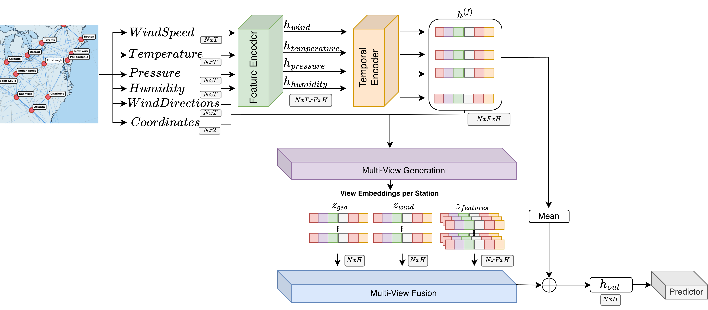
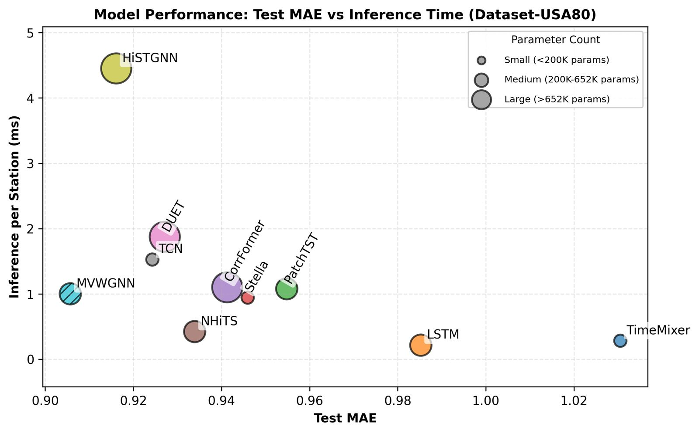

# MVWGNN: Multi-View Wind Graph Neural Network

Official implementation of **Multi-View Graph Neural Networks for Wind Speed Forecasting**
---



## Overview

MVWGNN is a graph neural network framework for multi-station wind speed forecasting that integrates three complementary graph views:

1. **Geographic Proximity View**: Captures spatial dependencies based on physical distances between weather stations
2. **Feature Similarity Views**: Separate graphs for each meteorological variable (pressure, temperature, humidity, wind speed) based on temporal correlation patterns
3. **Wind Propagation View**: Physics-informed directional airflow modeling with temporal lag, representing upstream-downstream relationships

A semantic attention mechanism learns optimal view combinations, allowing the model to dynamically weight different relationship types for improved forecasting accuracy.

---

## Key Features

- **Multi-view graph construction** with three complementary spatial relationship types
- **Physics-informed wind propagation** with directional alignment and temporal lag
- **Feature-specific similarity graphs** capturing variable-wise correlation patterns
- **Semantic attention fusion** for adaptive view weighting
- **Proper temporal splitting** to prevent data leakage
- **Flexible architecture** with configurable views and graph layer types (GraphSAGE, GCN, GAT)

---

Install dependencies:
```bash
pip install -r requirements.txt
```

---

## Dataset Preparation

### 1. UK-Wind (CEDA Dataset)
- 15 weather stations across the UK
- Time span: 2019-2024
- Data files in `ceda_data/`

### 2. USA-Wind (Kaggle Dataset)
- 30 weather stations across USA/Canada
- Time span: 2012-2017
- Download data from https://www.kaggle.com/datasets/selfishgene/historical-hourly-weather-data
- Place data files in `data/` following the same format as `ceda_data/`

Each CSV file should have:
- `datetime` column
- One column per city with measurements

---

## Quick Start

### Training

Train with default configuration (UK dataset, 80/10/10 split):
```bash
python train.py --dataset ceda_data
```

Train on USA dataset with custom split:
```bash
python train.py --dataset hourly-data --train_ratio 0.6 --val_ratio 0.2 --test_ratio 0.2
```

### Key Arguments

**Data Arguments:**
- `--dataset`: Dataset name (`ceda_data` or `hourly-data`)
- `--train_ratio`: Training set ratio (default: 0.8)
- `--val_ratio`: Validation set ratio (default: 0.1)
- `--window_size`: Lookback window size in hours (default: 24)

**Model Arguments:**
- `--hidden_dim`: Hidden dimension size (default: 128)
- `--max_wind_lag`: Maximum wind propagation lag (default: 6 hours)
- `--k_geo_neighbors`: Number of geographic neighbors (default: 5)
- `--k_feature_neighbors`: Number of feature-similar neighbors (default: 5)
- `--residual_weight`: Residual connection weight (default: 0.2)
- `--layer_type`: Graph layer type (`sage`, `gcn`, or `gat`)

**View Configuration:**
- `--use_feature_view`: Enable feature similarity views (default: True)
- `--use_geo_view`: Enable geographic view (default: True)
- `--use_prop_view`: Enable wind propagation view (default: True)

**Training Arguments:**
- `--epochs`: Number of training epochs (default: 100)
- `--batch_size`: Batch size (default: 32)
- `--lr`: Learning rate (default: 1e-3)
- `--patience`: Early stopping patience (default: 10)

---

## Example Configurations

```bash
python train.py \
    --dataset hourly-data \
    --train_ratio 0.8 \
    --val_ratio 0.1 \
    --test_ratio 0.1 \
    --hidden_dim 128 \
    --max_wind_lag 6 \
    --k_geo_neighbors 5 \
    --k_feature_neighbors 5 \
    --residual_weight 0.2 \
    --layer_type sage \
    --epochs 100
```

### Ablation: Geographic + Feature Views Only
```bash
python train.py \
    --dataset ceda_data \
    --use_prop_view False
```

### Ablation: Geographic View Only
```bash
python train.py \
    --dataset ceda_data \
    --use_feature_view False \
    --use_prop_view False
```

---

- Dataset sources:
  - UK-Wind: [CEDA UK Met Office Database](https://data.ceda.ac.uk/)
  - USA-Wind: [Kaggle Historical Hourly Weather Data](https://www.kaggle.com/datasets/selfishgene/historical-hourly-weather-data)



